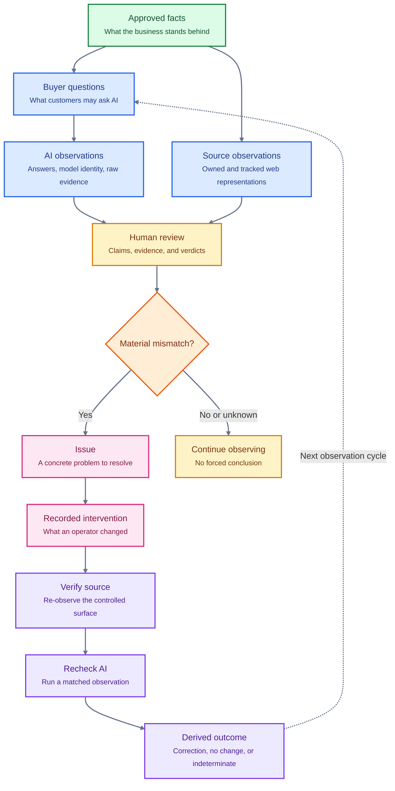

# Ghostping

[](https://github.com/commonfields/ghostping/actions/workflows/ci.yml)
[](https://github.com/commonfields/ghostping/releases/latest)
[](LICENSE)
[](https://nodejs.org/)
[](https://pnpm.io/)
[](https://www.rust-lang.org/)

> Know what AI tells customers about your company, trace important problems to evidence, correct what you control, and verify what changes afterward.

Ghostping is an AI representation integrity system. It connects a business's approved facts to observations from AI systems and web sources, keeps human judgment separate from collected evidence, records corrective work, and verifies what changed after that work.

Ghostping does not turn incomplete evidence into a score or claim that one change caused another:

> Observation is not interpretation. Interpretation is not authority. Correlation is not causality. Unknown is not false.

## How it works



The colors describe responsibility in the loop: green is authoritative business truth, blue is machine observation, amber is human review, orange is a decision boundary, pink is operator action, and purple is verification. Every important transition is persisted in PostgreSQL, and before/after outcomes are derived from evidence rather than manually asserted.

## What Ghostping provides

- **Truth management:** versioned, approved facts that record what a business currently stands behind.
- **AI checks:** buyer questions run through a deterministic offline mock provider or an explicitly enabled, pinned 9Router model.
- **Evidence review:** raw observations, candidate claims, citations, and human judgments remain distinct.
- **Issue workflow:** contradictions and partial answers become traceable issues instead of aggregate scores.
- **Representation tracking:** known web sources can be observed and compared with authoritative facts.
- **Owned-site discovery:** bounded, robots-aware scans find pages that may repeat current or historical fact values.
- **Intervention verification:** operators record manual corrections, verify the source, recheck AI, and inspect a derived outcome.
- **Tenant isolation:** hosted data and reads are scoped to the authenticated account; resources outside that scope are not exposed.

## Hosted quick start

### Prerequisites

- Node.js 24, as pinned in [`.node-version`](.node-version)
- pnpm 10.12.1
- PostgreSQL 16 recommended, matching CI

### 1. Install dependencies

```bash
git clone https://github.com/commonfields/ghostping.git
cd ghostping
pnpm install --frozen-lockfile
```

### 2. Prepare the database

```bash
createdb ghostping
export DATABASE_URL="postgres://localhost:5432/ghostping"
pnpm db:migrate
```

Optional: load the Northstar demonstration business.

```bash
pnpm db:seed
```

### 3. Start the hosted services

Run each service in a separate terminal from the repository root. Keep `DATABASE_URL` available in the API and worker terminals.

```bash
# Terminal 1: HTTP API on port 3001
pnpm --filter @ghostping/api dev

# Terminal 2: AI-check and discovery workers
pnpm --filter @ghostping/worker dev

# Terminal 3: web app on port 3000
pnpm --filter @ghostping/web dev
```

Open [http://localhost:3000](http://localhost:3000), create an account and business, then add approved facts and run a check. The default `mock` provider is deterministic, offline, and requires no credentials.

## Configuration

| Variable | Required | Default | Purpose |
| --- | --- | --- | --- |
| `DATABASE_URL` | Yes | None | PostgreSQL connection used by the API, worker, migrations, and seed command. |
| `PORT` | No | `3001` | Hosted API port. |
| `APP_BASE_URL` | No | `http://localhost:3000` | Web origin used to decide whether session cookies require `Secure`. |
| `WORKER_POLL_MS` | No | `1000` | Idle worker poll interval; accepted range is 1–60,000 ms. |
| `NINE_ROUTER_ENABLED` | No | `false` | Enables the live provider path. Keep disabled for local development and tests. |
| `NINE_ROUTER_BASE_URL` | When customized | `http://localhost:20128/v1` | 9Router-compatible endpoint; only HTTPS or an exact loopback HTTP address is accepted. |
| `NINE_ROUTER_API_KEY` | When live provider is enabled | None | Provider credential. Never commit or log it. |
| `NINE_ROUTER_MODEL` | When live provider is enabled | None | Required model pin for reproducible provider requests. |
| `NINE_ROUTER_TIMEOUT_MS` | No | `60000` | Live request timeout; accepted range is 1–300,000 ms. |
| `PROVIDER_RESPONSE_MAX_BYTES` | No | `2097152` | Maximum captured provider response size; hard-capped at 16 MiB. |

Live provider calls may cost money and send prompts to an external service. Enabling the provider fails closed when its endpoint, key, or model pin is invalid. Use the mock provider for normal development and automated tests.

## Architecture

| Area | Responsibility |
| --- | --- |
| [`apps/web`](apps/web) | React 19, Vite, Tailwind CSS, and Radix UI workspace for overview, issues, representations, truth, and checks. |
| [`apps/api`](apps/api) | Effect HTTP API with server-side sessions, request validation, and account-scoped repositories. |
| [`apps/worker`](apps/worker) | Two independent, bounded Effect loops for AI check runs and owned-site discovery. |
| [`packages/domain`](packages/domain) | Canonical domain types and validation rules. |
| [`packages/contracts`](packages/contracts) | Shared API request and response contracts. |
| [`packages/db`](packages/db) | PostgreSQL migrations and Effect repositories; the only hosted persistence layer. |
| [`packages/protocol`](packages/protocol) | Evidence packet schemas, canonical serialization, digests, fixtures, and outcome derivation. |
| [`packages/providers`](packages/providers) | Offline mock and fail-closed 9Router provider adapters. |
| [`packages/representation`](packages/representation) | Safe HTTP collection, extraction, and deterministic source comparison. |
| [`packages/discovery`](packages/discovery) | Robots and sitemap-aware crawling, bounded frontier processing, and candidate matching. |
| [`packages/truth`](packages/truth) | Authority manifests and deterministic truth projection tools. |

The hosted stack uses 15 ordered PostgreSQL migrations. Evidence and workflow records are append-oriented where history matters; derived views can be recomputed from their source records. The worker contains failures within each loop so a discovery failure does not stop queued AI checks, or vice versa.

## Security and evidence boundaries

- Authentication uses server-side sessions and `HttpOnly`, `SameSite=Lax` cookies.
- Authorization is enforced in account-scoped server repositories, not inferred from client state.
- Provider credentials are read as redacted configuration and are not part of stored evidence.
- Live provider access is disabled by default and requires an explicit model pin.
- Source collection is bounded and validated; discovery does not recursively crawl without limits.
- Missing, failed, or ambiguous observations remain `UNKNOWN`; they are never converted into false claims.
- A recorded intervention proves that work was recorded, not that it was deployed, indexed, retrieved, or responsible for a later AI answer.

## Local CLI and desktop app

This repository also contains a local-first Rust CLI in [`src`](src) and a Tauri desktop app in [`tauri-app`](tauri-app). They have their own configuration, storage, and release lifecycle; they do not share a runtime with the hosted TypeScript stack.

Install the latest CLI release on macOS or Linux:

```bash
curl -fsSL https://raw.githubusercontent.com/commonfields/ghostping/main/scripts/install.sh | bash
```

The installer downloads the matching release archive and verifies it against the published SHA-256 manifest before installation. Windows users can use [`scripts/install.ps1`](scripts/install.ps1). To build locally instead:

```bash
cargo build --release --locked
./target/release/ghostping quickstart
```

The CLI's GEO measurements are directional local measurements, not hosted evidence packets.

## Development and verification

Run the same primary gates enforced by CI:

```bash
# Hosted TypeScript workspace
pnpm typecheck
pnpm lint
pnpm test
pnpm build

# Rust CLI and protocol reader
cargo fmt --all -- --check
cargo clippy --all-targets --all-features -- -D warnings
cargo test --all-targets --locked
cargo build --release --locked
```

Database integration tests use PostgreSQL when `DATABASE_URL` or `TEST_DATABASE_URL` is present. CI runs them against PostgreSQL 16 with live providers disabled.

When protocol schemas or fixtures change, regenerate and verify the committed artifacts:

```bash
pnpm --filter @ghostping/protocol schemas
pnpm --filter @ghostping/protocol fixtures
```

See [CONTRIBUTING.md](CONTRIBUTING.md) before changing provider, prompt-plugin, CLI, or desktop behavior.

## Documentation

- [Evidence protocol](docs/protocol/README.md)
- [Representation graph](docs/representation-graph/README.md)
- [Truth projection](docs/truth/README.md)
- [Hosted Effect architecture](docs/engineering/hosted-effect-architecture-v1.md)
- [Product roadmap](docs/product/roadmap.md)
- [CLI exit contracts](docs/engineering/cli-exit-contracts.md)

## License

Ghostping is available under the [MIT License](LICENSE).
